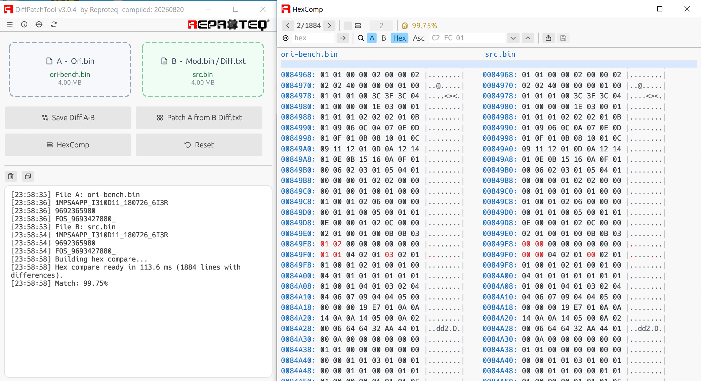
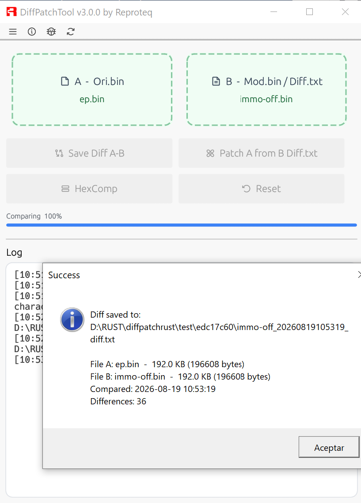
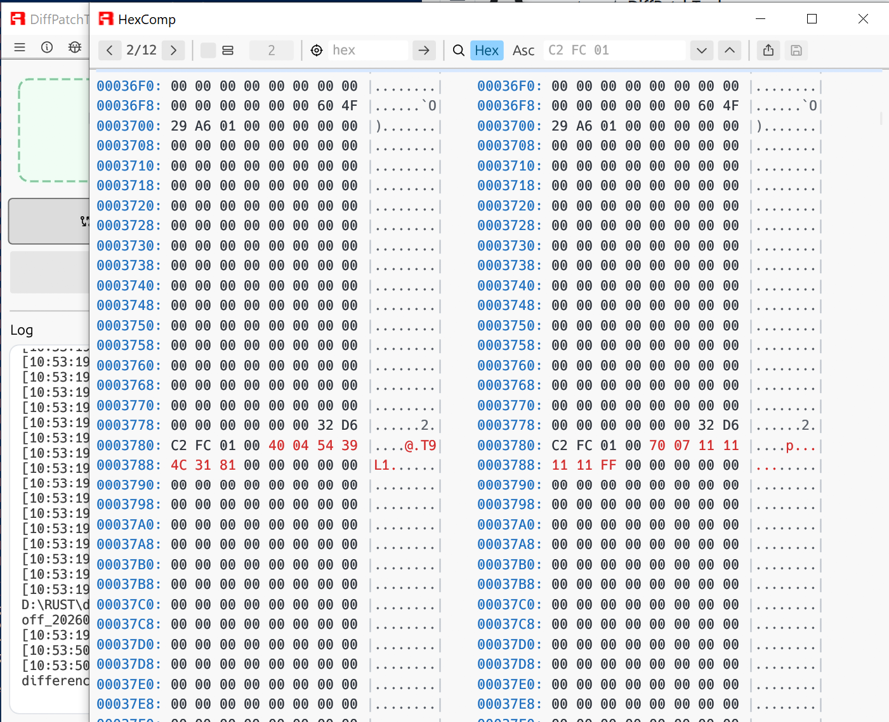
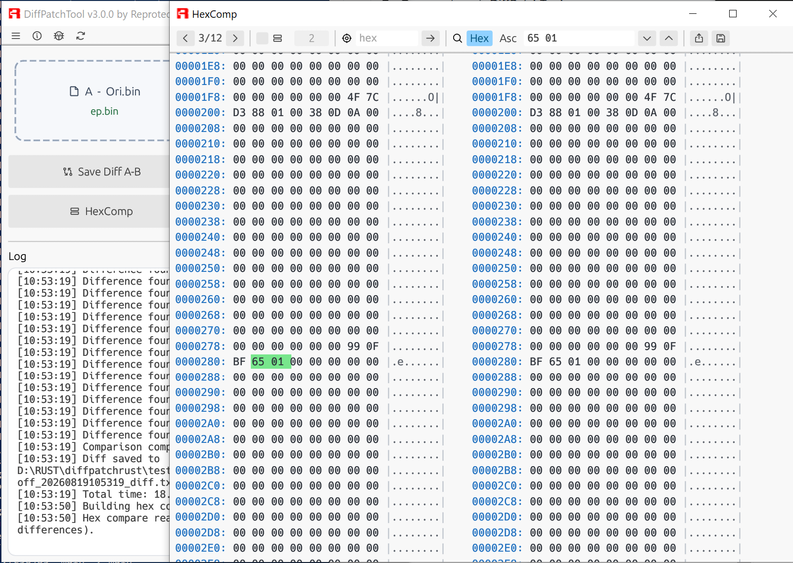
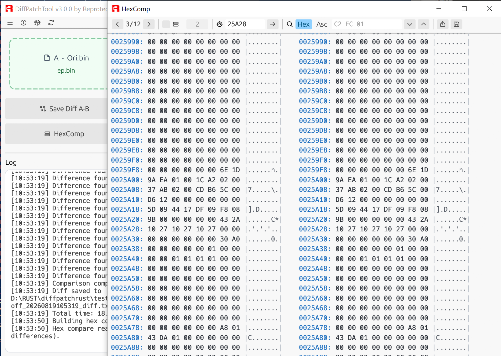
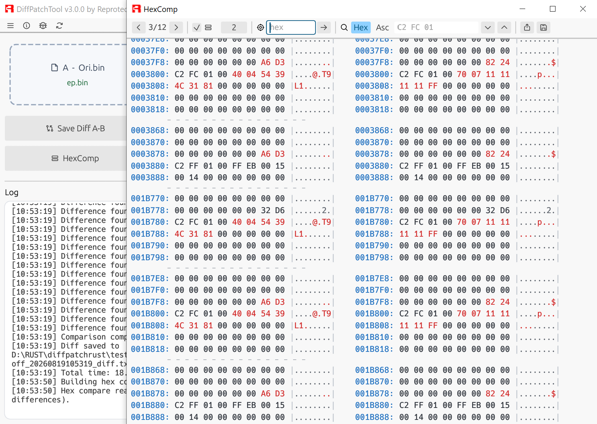
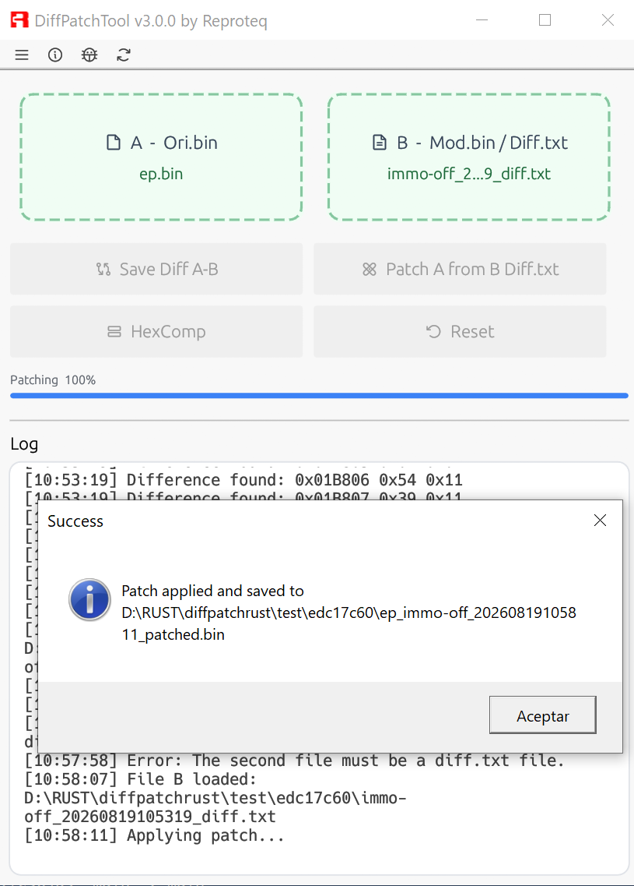

# DiffPatchTool

**DiffPatchTool** is a desktop tool to **compare, generate diffs, apply patches, inspect and edit binary files** — designed especially for working with ECU firmware (`.bin`), but valid for any pair of binary files.

Written in **Rust** with [egui/eframe](https://github.com/emilk/egui), it compiles to a **single portable `.exe`** with no external dependencies: modern light theme, embedded icons, color hex viewer and auto-update from GitHub.

by **Reproteq** · Author: **Alex G.T.**



## 🎥 Demo video

[](https://youtu.be/3J5tLWyz9hs)

---

## Table of contents

- [Features](#features)
- [Diff format](#diff-format-3-columns)
- [Usage](#usage)
  - [Load files](#1-load-files-a-and-b)
  - [Save diff (patch)](#2-save-diff-a-b)
  - [Apply patch](#3-apply-patch)
  - [Hex comparator](#4-hex-comparator-hexcomp)
  - [Edit bytes](#5-edit-bytes)
  - [Search and navigate](#6-search-and-navigate)
- [Updates](#updates)
- [Building](#building)
- [Icons and customization](#icons-and-customization)
- [Support my work](#-support-my-work)

---

## Features

- **Byte-by-byte comparison** of two files with the list of differences.
- **Diff in 3-column format** (`address`, `old value`, `new value`), **backward compatible** with legacy 2-column patches.
- **Patch application** with optional verification of the original value and a warning if the base file doesn't match.
- **Hex comparator** editor-style: two side-by-side panels A | B, changed bytes in red, offsets in blue.
- **Byte editing** in both A and B directly on the hex, and saving as a new `.bin`.
- **Search** by hex or ASCII, with green highlighting.
- **Navigation** between differences and jump to an offset (`Goto`).
- **Progress bar** for operations on large files (work runs in the background, the UI never freezes).
- **Timestamps** in the log and in the names of generated files.
- **Auto-update** from GitHub Releases.
- **Report bugs** by email with one click.

---

## Diff format (3 columns)

When saving a diff, three columns are written:

```
0xADDR   0xOLD   0xNEW
```

| Column  | Meaning                                       |
|---------|-----------------------------------------------|
| `ADDR`  | offset (address) of the byte that changes     |
| `OLD`   | old value (byte from file A / original)       |
| `NEW`   | new value (byte from file B / modified)       |

Example:

```
0x001A20 0x00 0xAB
0x001A21 0xFF 0xCD
```

**Backward compatibility:** an old 2-column patch (`0xADDR 0xNEW`) still applies without issues. Each line is interpreted by its number of columns, so the value that gets written is always the correct one. When applying a 2-column patch, the app warns that it does not contain the old-values column.

---

## Usage

### 1. Load files A and B

Drag and drop the files onto the **A** (original) and **B** (modified or a `diff.txt`) zones, or click each zone to pick them. You can also use the functions menu.



### 2. Save diff A-B

Compares A and B and saves the differences to a file `<B>_<timestamp>_diff.txt` in 3-column format. It shows the name, size and date of each file, and the number of differences found.



### 3. Apply patch

Load the original in **A** and a `diff.txt` in **B**, and it generates a patched file `<A>_<...>_patched.<ext>`. If the patch carries the old-values column, it is verified against A and warns you if the base file is not the correct one.



### 4. Hex comparator (HexComp)

Opens a **separate window** with the hex dump of A and B side by side:

- **Offsets in blue**, **changed bytes in red**.
- **"Only differences"** mode (with configurable context lines) or **whole binary**.
- ASCII column to the right of each panel.



### 5. Edit bytes

Inside the comparator you can **edit bytes** in both A and B:

- **Click** a byte to select it (yellow background) and type **2 hex digits** to change it; it automatically advances to the next one.
- **←/→ arrows** to move, **Esc** to deselect.
- Edited bytes are marked in **orange**.
- The **floppy disk** icon saves the edited A and/or B as a new `.bin` (it does not overwrite the original).
- The **export** icon saves the diff (patch) of the current state, **including your edits**.



### 6. Search and navigate

- **Goto**: type a hexadecimal offset and jump to it, centered in the view.
- **Find**: search for a sequence in **Hex** (`C2 FC 01`) or **ASCII** (text), with an **A / B** panel selector, green highlighting and next/previous match buttons.
- **Difference arrows**: step through the differences one by one, centering each one on screen.



---

## Updates

DiffPatchTool automatically checks for a new version on GitHub **at startup** and also via the **check for updates** button in the top bar. If a newer release is available, a button appears to **download and install** the update, which replaces the executable. After updating, close and reopen the application.

---

## Building

Requires [Rust](https://rustup.rs) installed.

```bash
cargo run            # build and run (development)
cargo build --release
```

The final executable is placed at `target/release/DiffPatchTool.exe`.

On Linux the GUI development libraries are needed the first time:

```bash
sudo apt install libxcb1-dev libxkbcommon-dev libwayland-dev \
                 libgtk-3-dev libglib2.0-dev pkg-config
```

### Application icon

Place an `icon.ico` (multi-resolution: 16, 32, 48, 256) in `assets/icon.ico`. With that:

- The **window icon** is embedded in the binary.
- The **`.exe` icon** (Explorer and taskbar) is embedded by `build.rs` when building on Windows.

---

## Icons and customization

The interface uses [Phosphor](https://phosphoricons.com/) icons (embedded in the binary via `egui-phosphor`), so they look the same on any system. The theme colors, the hex viewer colors and sizes are adjusted in the code (`setup_style`, `hex_row_layout`).

---

## ☕ Support my work

If you find this project useful and would like to support its development, please consider making a donation. Any amount is welcome and greatly appreciated!

**Bitcoin (BTC):**

```
1Mmwhdw4mQzbuLbmPFdEF2uXMVi8X3kv68
```

**PayPal:** reproteq@gmail.com

| Amount       | Donation link                                                        |
|--------------|----------------------------------------------------------------------|
| €1           | [Donate €1](https://paypal.me/reproteqofficial/1)                    |
| €5           | [Donate €5](https://paypal.me/reproteqofficial/5)                    |
| €10          | [Donate €10](https://paypal.me/reproteqofficial/10)                  |
| €25          | [Donate €25](https://paypal.me/reproteqofficial/25)                  |
| €50          | [Donate €50](https://paypal.me/reproteqofficial/50)                  |
| €100         | [Donate €100](https://paypal.me/reproteqofficial/100)                |
| Custom       | [Donate a custom amount](https://paypal.me/reproteqofficial)         |

---

## License

© Reproteq. All rights reserved.

[](https://github.com/reproteq/DiffPatchTool/releases)
