<p align="center">
  
</p>

# DiffPatchTool


**[diffpatchtool.com](https://diffpatchtool.com)** · by **Reproteq** · Author: **Alex G.T.**

**DiffPatchTool** is a desktop application for **comparing, generating diffs, applying patches, inspecting, and editing binary files** — designed especially for working with ECU firmware (`.bin`), but suitable for any pair of binary files.

Written in **Rust**, it compiles to a **single portable `.exe`** with no external dependencies. It features a modern light theme, embedded icons, a colored hex viewer, an optional online patch catalog, and automatic updates from GitHub.

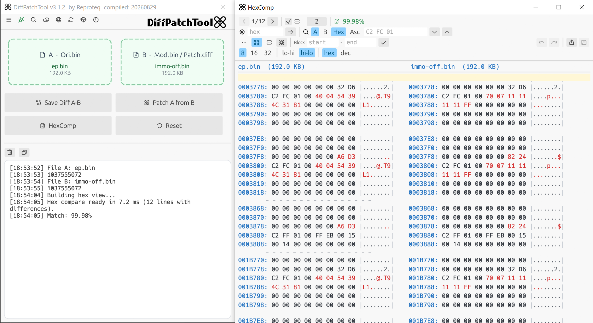
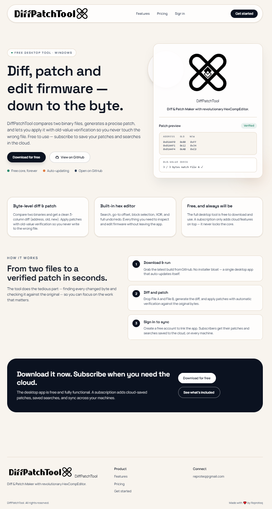

## Images Gallery


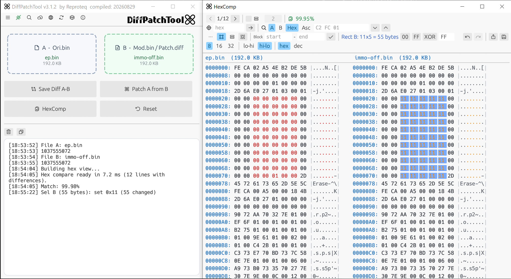
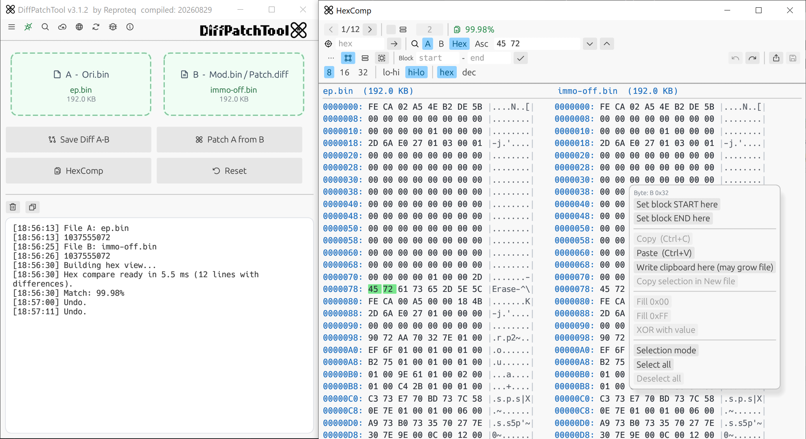
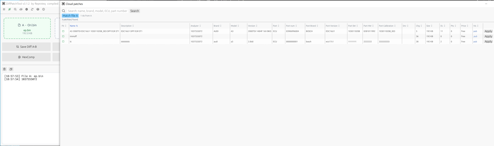
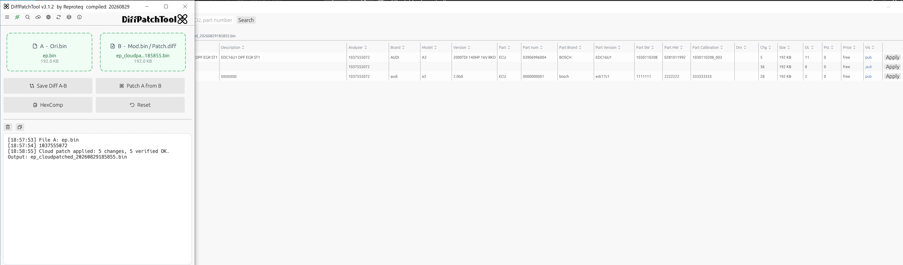
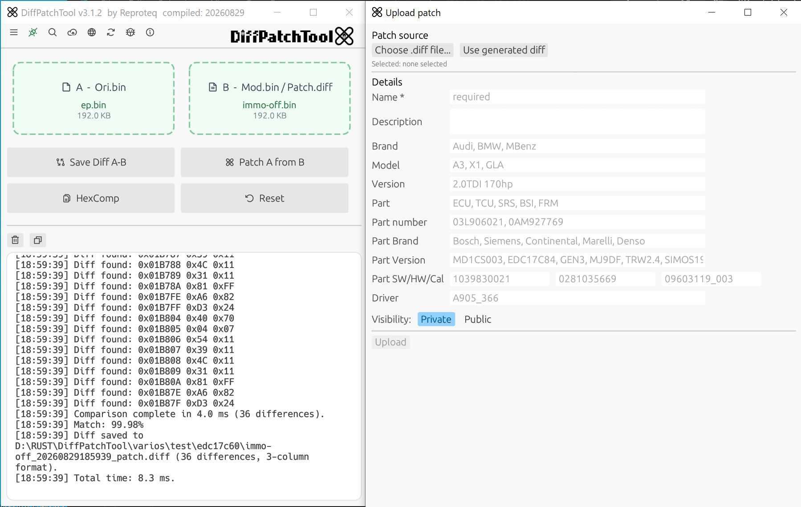
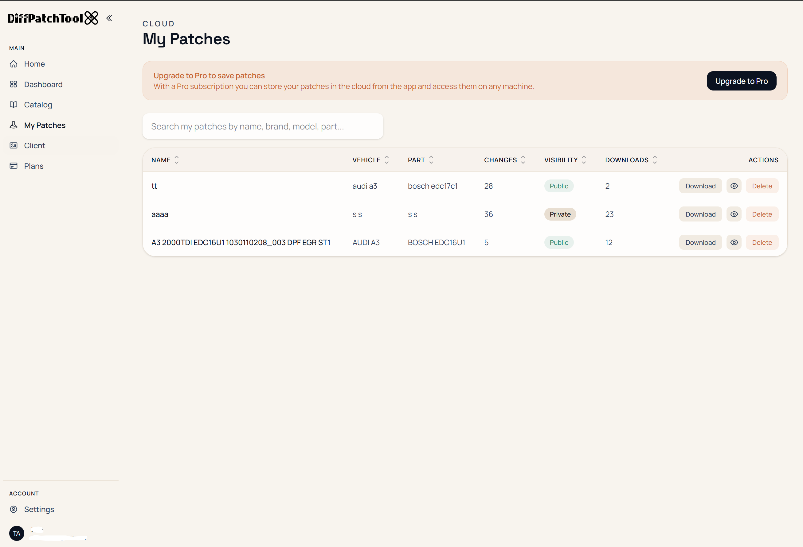
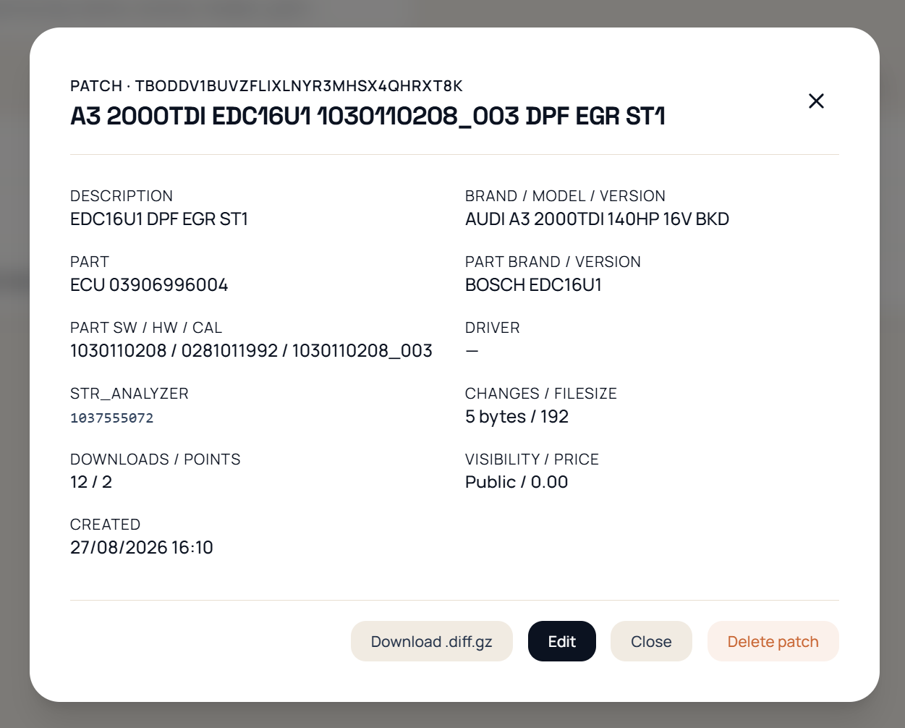
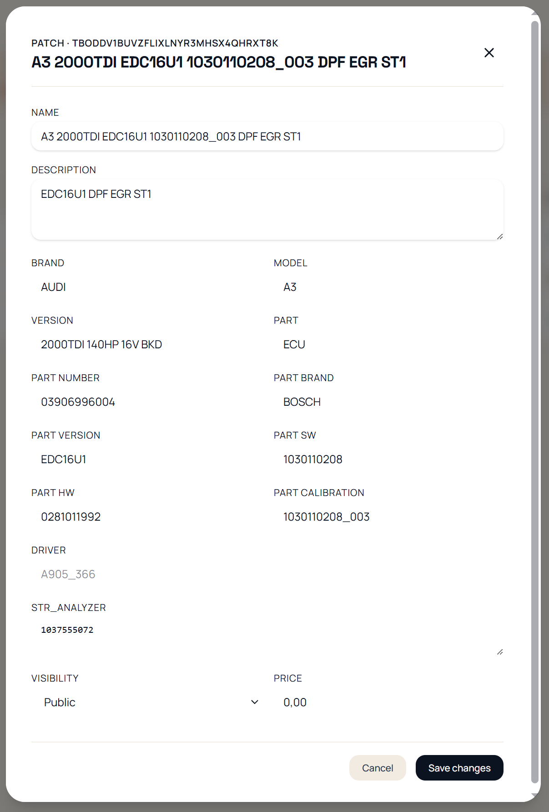
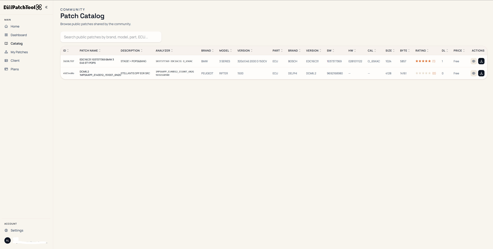

---

## Table of Contents

- [Features](#features)
- [Diff Format](#diff-format-3-columns)
- [Usage](#usage)
  - [Load Files](#1-load-files-a-and-b)
  - [Save Diff](#2-save-diff-a-b)
  - [Apply Patch](#3-apply-patch)
  - [Hex Comparator](#4-hex-comparator-hexcomp)
  - [Edit Bytes and Blocks](#5-edit-bytes-and-blocks)
  - [Search and Navigate](#6-search-and-navigate)
  - [Analyzer](#7-analyzer-ecu-identifiers)
- [Online Patch Catalog](#online-patch-catalog)
- [Account & Plans](#account--plans)
- [Server Connection](#server-connection)
- [Settings and System](#settings-and-system)
- [Updates](#updates)
- [Building](#building)
- [In Development / Future](#in-development--future)
- [Support My Work](#support-my-work)
- [Contact](#contact)
- [License](#license)

---

## Features

- **Byte-by-byte comparison** of two files using a list of differences.
- **3-column diff format** (`address`, `old value`, `new value`), with **backward compatibility** for older 2-column patches. Patches are saved as `_patch.diff`; older `.txt` patches are also supported.
- **Patch application** with original-value verification and a warning if the base file does not match.
- **Hex comparator** with an editor-style interface: two side-by-side A | B panels, changed bytes highlighted in red, offsets in blue, and an ASCII column.
- **Configurable dump view**: 8 / 16 / 32-bit, endianness (lo-hi / hi-lo), and base (hex / decimal) — inspired by WinOLS.
- **Advanced selection**: consecutive, rectangular, and row-based selection; define a block using start/end offsets; select/deselect all.
- **Selection operations**: fill with `00` / `FF`, `XOR`, or write a typed value across the entire block.
- **Copy and paste bytes** (Ctrl+C / Ctrl+V), preserving the rectangular shape when pasting.
- **Undo / redo** (Ctrl+Z / Ctrl+Y), including byte-by-byte editing.
- **Context menu** with copy, paste, fill, define block from byte, copy selection to a new file, and write to clipboard.
- **Hex and ASCII search** in A or B, with match highlighting.
- **Navigation** between differences and jump to a specific offset (`Goto`).
- **Analyzer**: extracts ECU identifiers automatically.
- **Online patch catalog**: search a public, community-driven catalog and download compatible patches — no full firmware ever leaves your machine.
- **Cloud sync** (optional): save your patches online and access them from any machine with a Pro or Premium account.
- **Persistent configuration** (`config.json`): remembers view preferences, selections, and options.
- **Progress bar** for large operations using background processing, keeping the interface responsive.
- **Automatic updates** from GitHub Releases, including automatic restart after installation.

---

## Diff Format (3 Columns)

Saving a diff produces three columns:

```text
0xADDR   0xOLD   0xNEW
```

- **ADDR** — offset (address) of the changed byte
- **OLD** — old value (byte from file A / original)
- **NEW** — new value (byte from file B / modified)

Patches are saved as:

```text
<B>_<timestamp>_patch.diff
```

Older `.txt` patches using either the 2-column or 3-column format are still supported.

---

## Usage

### 1. Load Files A and B

Drag and drop files onto **A** (original) and **B** (modified or a `.diff` file), or click each area to select them. Files can also be loaded from the Functions menu.

### 2. Save Diff A-B

Compare A and B and save the differences to:

```text
<B>_<timestamp>_patch.diff
```

The diff uses the 3-column format. The application displays the name, size, and date of each file, along with the number of differences found.

### 3. Apply Patch

Load the original file into **A** and a `.diff` file (or an older `.txt` patch) into **B** to generate a patched file.

If the patch contains the original values, DiffPatchTool verifies that they match the values in A and displays a warning if the base file is not the correct one.

### 4. Hex Comparator (HexComp)

Opens a **separate window** displaying the hexadecimal dump of A and B side by side.

- **Offsets in blue**, **changed bytes in red**, and **edited bytes in orange**.
- **"Differences only"** mode with context lines, or **full binary** mode.
- **Configurable view**: 8 / 16 / 32-bit, endianness (lo-hi / hi-lo), and base (hex / decimal).
- Toolbar organized by function: navigation, location, selection/editing, and view controls.
- Can open **a single file** in editor mode in addition to comparing two files.

### 5. Edit Bytes and Blocks

- **Click** a byte to select it and type **2 hexadecimal digits** to change it; the cursor automatically advances to the next byte.
- **Selection modes**: consecutive, **rectangular** (only the columns within the rectangle), or row-based.
- **Define block** by entering the start and end offsets, or directly from the context menu on a byte.
- **Operations** on the selection: `00`, `FF`, `XOR`, or enter a value to apply it to the entire block.
- **Copy / paste** bytes (Ctrl+C / Ctrl+V); rectangular selections preserve their shape when pasted.
- **Undo / redo** (Ctrl+Z / Ctrl+Y).
- **Copy selection to a new file** (`.bin`).
- **Save** edited A and/or B as new `.bin` files, or **export the diff** of the current state including all edits.

### 6. Search and Navigate

- **Goto**: enter an offset in hexadecimal and jump directly to it, centered in the view.
- **Find**: search in **Hex** (`C2 FC 01`) or **ASCII** text, in either A or B, with highlighting and next/previous navigation.
- **Difference arrows**: navigate through differences one by one, automatically centering each.

### 7. Analyzer (ECU Identifiers)

When a file is loaded, the **Analyzer** automatically extracts relevant identifiers such as Bosch part numbers, EDC17 / MED17 / MD1 versions, and other ECU-related information. It can be enabled or disabled from **Settings**.

---

## Online Patch Catalog

DiffPatchTool connects to a **public patch catalog** at [diffpatchtool.com/catalog](https://diffpatchtool.com/catalog) — browsable by anyone, **no account required**.

- **Search by vehicle, ECU, hardware/software version, or signature.** When a file is loaded, the app can find patches that match it using **address/value fingerprints** — your full firmware is never uploaded.
- **Verify before applying.** Each candidate carries its start/end signatures, so the app checks that the expected original bytes are present in your file before you patch anything.
- **Community ratings.** Patches can be rated 1–5 stars, so you can see what actually works.
- **Public or private.** Mark each patch public to share it with the community, or keep it private for yourself.
- **No duplicates.** Every upload is checked by a content hash, so the public catalog stays clean.

---

## Account & Plans

Logging in is **optional** — all local features work without an account or Internet connection. An account adds cloud features on top.

Uploads and downloads share a single **daily allowance**, on both the desktop app and the website. **Downloading your own patches is always free.**

| Plan | Daily limit | Price |
|------|-------------|-------|
| Free | 10 / day | 0€ |
| Pro | 30 / day | 9.99€/mo |
| Premium | 100 / day | 29.90€/mo |

- **Cloud-saved patches** and **synced searches** across every machine you use.
- **Device management**: your account can be linked to a limited number of machines, managed from the web portal.

See full details at [diffpatchtool.com/pricing](https://diffpatchtool.com/pricing).

---

## Server Connection

DiffPatchTool can **optionally** connect to the server at [diffpatchtool.com](https://diffpatchtool.com) for online features.

**Logging in is not required to use the application** — all local features remain available without an account or Internet connection.

- **Connection icon** in the toolbar: gray when disconnected, green when connected. Clicking it opens the login dialog or logs out.
- **Optional login** using a diffpatchtool.com account. The session can be remembered between launches using a token.
- Connecting enables **saving and sharing patches**, **searching the catalog against the currently loaded file**, and **checking whether a patch matches** it.

---

## Settings and System

- **Settings** configure app preferences (view, analyzer, and more).
- **System** menu displays system information:
  - Machine identifier (**HWID**)
  - Operating system
  - CPU
  - RAM
  - Executable path
  - Application version

---

## Updates

DiffPatchTool checks for a new version on GitHub **at startup** and through the toolbar update button.

If a newer release is available, a button lets you **download and install the update**. The executable is replaced and the application **automatically restarts** after installation.

---

## Building

```text
DiffPatchTool.exe is compiled and ready to use — just download it. 🎉
```

---

## In Development / Future

DiffPatchTool is under active development. Upcoming work includes:

- **Smarter catalog matching**: rank compatible patches by fingerprint confidence and ECU identifiers.
- **Patch marketplace**: optional paid patches, with ratings and download stats.
- **More hex viewer modes**: float, signed, and binary representations.
- **Offline license hardening** for cloud features.
- Continuous performance and usability improvements.

---

## Support My Work

If you find this project useful and would like to support its development, **any amount is welcome and greatly appreciated!**

**PayPal:** reproteq@gmail.com

**Quick donate:** [€1](https://www.paypal.com/paypalme/reproteqofficial/1) · [€5](https://www.paypal.com/paypalme/reproteqofficial/5) · [€10](https://www.paypal.com/paypalme/reproteqofficial/10) · [€25](https://www.paypal.com/paypalme/reproteqofficial/25) · [€50](https://www.paypal.com/paypalme/reproteqofficial/50) · [€100](https://www.paypal.com/paypalme/reproteqofficial/100) · [Any amount](https://www.paypal.com/paypalme/reproteqofficial)

**Bitcoin (BTC):**

```text
1Mmwhdw4mQzbuLbmPFdEF2uXMVi8X3kv68
```

---

## Contact

- Website: [diffpatchtool.com](https://diffpatchtool.com) · [reproteq.com](https://reproteq.com)
- Email: reproteq@gmail.com
- Telegram: [@reproteq](https://t.me/reproteq)

## Special Thanks

- **Ali-G** ❤️ — For your incredible contribution and support! 🎉

---

## License

© Reproteq. All rights reserved.
